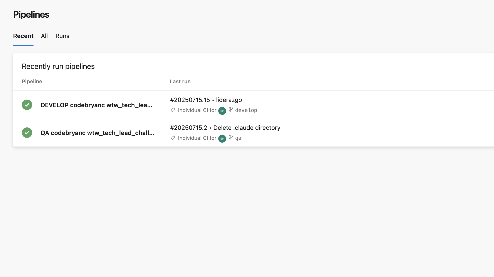
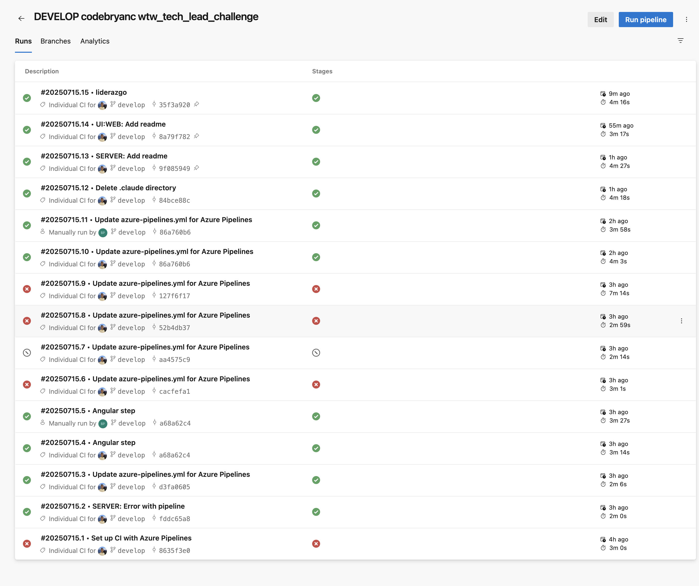
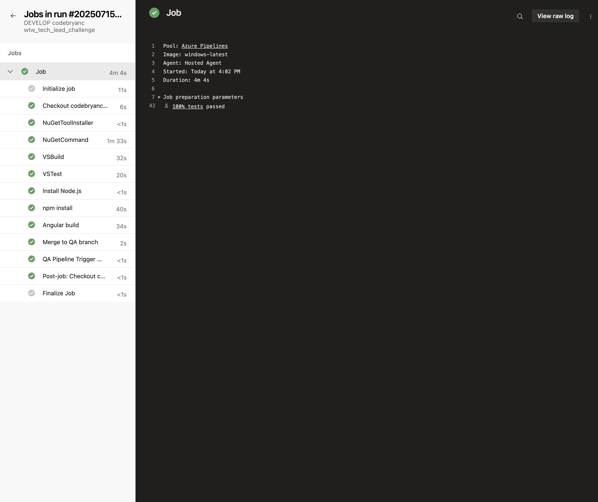

# DevOps Strategy

## 1. Cómo harías los despliegues por entorno (dev, QA, prod)

Lo primero que haría sería implementar GitFlow, es una metodología que nos permite aislar comportamientos y features a ramas específicas:

- A. Nos permite hacer varios features a la vez
- B. Nos permite enviar features independientes a Producción inclusive si un feature inicia después de otro pero termina antes
- C. Nos permite atender tickets con prioridad en producción

### Pasos:

**Dev** -> de acá tomaríamos el branch del feature, luego de esto pruebas por feature (sanity) + pruebas unitarias, de integración y visuales de componente.

Una vez aprobado lo enviaríamos a **QA** -> en este punto debemos hacer pruebas de regresión, ejecutar pruebas automáticas y hacer un smoke test del feature

Por último lo enviaríamos a **producción** máximo (lunes, martes o miércoles) para atender cualquier error posterior a la publicación.

## 2. Cómo manejarías secrets y configuraciones

Usaría una herramienta de vault tipo 1password para tener seguridad en las aplicaciones que estamos manteniendo y Key Vault en Microsoft para pipelines lo cual nos permita almacenar correctamente la información y NO comprometerla con relación a credenciales y seguridad de la información, en este caso contraseñas.

## 3. Qué mecanismos usarías para rollback automático si algo falla en producción

Lo primero es que mantendría de ser posible un ambiente Staging intentando que sea lo más parecido posible a producción. No es exactamente igual un ambiente réplica que uno productivo, esto teniendo en cuenta que un ambiente productivo maneja información diariamente.

Publicaría con un margen de maniobra (Evitando jueves - viernes) para poder estar atento al día siguiente si hay reportes de producción.

Lo ideal es hacer un backup del ambiente actual en producción lo que nos permite volver rápidamente si algo falla (y durante la evaluación del error sabemos que es crítico / o tomará mucho tiempo resolver)
- Si algo falla en el paso a production debemos analizar, porque ese error no se presentó en Staging y muy seguramente ahí podemos configurar staging de manera correcta

Según la prueba: Podemos crear un pipeline que haga los build y una vez este build se ejecute correctamente, luego ejecute pruebas automáticas, podemos hacer el deploy a producción

## Pipelines

